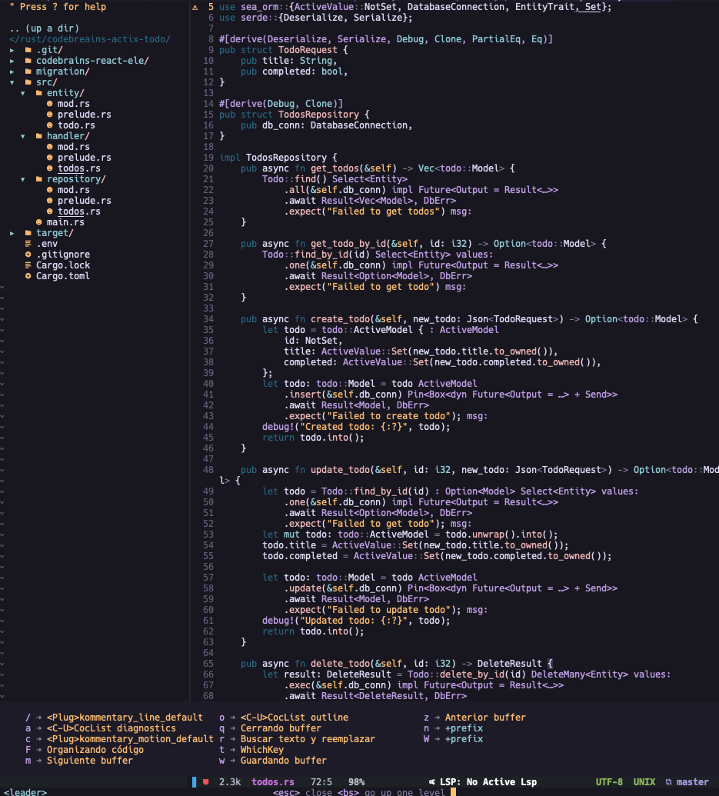

# Installation
Cloning GitHub repo into ~/.config/nvim or your directory and run file .install.sh.

# Screenshots

# Packer
| Command                             | Description                                                        |
| ----------------------------------- | ------------------------------------------------------------------ |
| `PackerInstall`                     | Install plugins                                                    |
| `PackerClean`                       | Install or update plugins                                          |
| `PackerCompile`                     | Upgrade vim-plug itself                                            |
| `PackerSync`                        | Check the staus and update plugins                                 |
| `PlugStatus`                        | Check the status of plugins                                        |

# Keybindings

h   move one character left
j   move one row down
k   move one row up
l   move one character right
w   move to beginning of next word
b   move to previous beginning of word
e   move to end of word
W   move to beginning of next word after a whitespace
B   move to beginning of previous word before a whitespace
E   move to end of word before a whitespace

0   move to beginning of line
$   move to end of line
_   move to first non-blank character of the line
g_  move to last non-blank character of the line

gg  move to first line
G   move to last line
ngg move to n'th line of file (n is a number; 12gg moves to line 12)
nG  move to n'th line of file (n is a number; 12G moves to line 12)
H   move to top of screen
M   move to middle of screen
L   move to bottom of screen

zz  scroll the line with the cursor to the center of the screen
zt  scroll the line with the cursor to the top
zb  scroll the line with the cursor to the bottom

Ctrl-D  move half-page down
Ctrl-U  move half-page up
Ctrl-B  page up
Ctrl-F  page down
Ctrl-O  jump to last (older) cursor position
Ctrl-I  jump to next cursor position (after Ctrl-O)
Ctrl-Y  move view pane up
Ctrl-E  move view pane down

# TODO

| Description                                                   |
| ------------------------------------------------------------- |
| Add Keybindings readme.md                                     |
| Add config codeium readme.md                                  |
| Script shell for install plugins with packer terminal         | 
